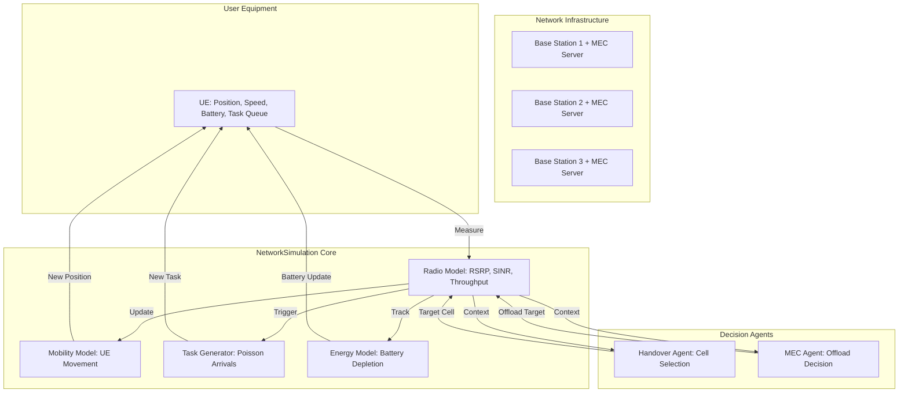

# Network Simulation Architecture

## Table of Contents

1. [System Overview](#system-overview)
2. [Core Components](#core-components)
3. [Service Profiles](#service-profiles)
4. [Radio Propagation Model](#radio-propagation-model)
5. [Mobility Model](#mobility-model)
6. [Task Generation and Scheduling](#task-generation-and-scheduling)
7. [Energy Model](#energy-model)
8. [Simulation Lifecycle](#simulation-lifecycle)
9. [Decision Interface](#decision-interface)
10. [State and Observation](#state-and-observation)
11. [Baseline Controller](#baseline-controller)

---

## System Overview

### Purpose

This simulation environment provides a controllable testbed for evaluating multi-agent decision policies in 5G/6G networks. It models two critical decision problems:

1. **Handover (HO)**: Which base station should serve the UE?
2. **MEC Offloading**: Where should computation tasks be executed (Local/Edge/Cloud)?

### Design Philosophy

- **Simplified Physics**: Not 3GPP-compliant; uses simplified radio models for computational efficiency.
- **Controllable**: Deterministic with optional random seeding.
- **Observable**: Full state visibility for RL training.
- **Modular**: Clean separation between radio, mobility, task generation, and decision logic.

### Architecture Diagram



---

## Core Components

### 1. BaseStation (BS)

**Purpose**: Provides radio coverage and edge computing resources.

**Attributes**:
| Attribute       | Type  | Default | Description                    |
| --------------- | ----- | ------- | ------------------------------ |
| `id`            | int   | -       | Unique identifier (0-indexed)  |
| `x`             | float | -       | Horizontal position (meters)   |
| `y`             | float | -       | Vertical position (meters)     |
| `tx_power_dbm`  | float | 46.0    | Transmit power (~40W)          |
| `noise_dbm`     | float | -93.0   | Thermal + receiver noise floor |
| `bandwidth_mhz` | float | 100.0   | Channel bandwidth              |

**Layout**:
Base stations are primarily arranged in a hexagonal grid to model realistic urban deployments (ISD = 500m). For simplified cases, a horizontal arrangement may be used.

**Method**:

- `distance_to(x, y)`: Euclidean distance to a point.

---

### 2. UserEquipment (UE)

**Purpose**: Mobile device that moves through the network, generates tasks, and consumes energy.

**Attributes**:
| Attribute        | Type  | Default | Description                        |
| ---------------- | ----- | ------- | ---------------------------------- |
| `x`              | float | -       | Current X position (meters)        |
| `y`              | float | -       | Current Y position (meters)        |
| `speed_mps`      | float | 10.0    | Movement speed (m/s, ~36 km/h)     |
| `direction_rad`  | float | -       | Movement direction (radians)       |
| `local_cpu_ghz`  | float | 2.5     | Local CPU capacity (modern mobile) |
| `battery_joules` | float | 1000.0  | Remaining battery energy (Joules)  |

**Lifecycle**:

1. **Initialization**: Random or fixed start position via `reset()`.
2. **Movement**: Updated every `step()` using `UE.step(dt_s, area_size)`.
3. **Reflection**: Bounces off boundaries like a billiard ball:
   - If `x < 0` or `x > max_x`: Reflect horizontally (`θ = π - θ`).
   - If `y < 0` or `y > max_y`: Reflect vertically (`θ = -θ`).

---

### 3. MecServer

**Purpose**: Edge compute node attached to each base station.

**Attributes**:
| Attribute     | Type  | Default | Description                       |
| ------------- | ----- | ------- | --------------------------------- |
| `id`          | int   | -       | Unique identifier (matches BS id) |
| `attached_bs` | int   | -       | Parent base station ID            |
| `cpu_ghz`     | float | 200.0   | CPU capacity (Edge GPU Cluster)   |

**Topology**: One MEC server per BS (co-located).

---

### 4. Task

**Purpose**: Represents a computation job with latency and energy constraints.

**Attributes**:
| Attribute        | Type  | Description                               |
| ---------------- | ----- | ----------------------------------------- |
| `id`             | int   | Unique task identifier                    |
| `arrival_time_s` | float | Simulation time when task was generated   |
| `data_size_bits` | float | Upload data size (for offloading)         |
| `cpu_cycles`     | float | Required CPU cycles                       |
| `deadline_s`     | float | Absolute deadline (arrival_time + budget) |
| `service_type`   | str   | Service profile name ("VR", "EV", "IoT")  |

**Generation**: Follows a Poisson process with inter-arrival times sampled from an exponential distribution.

---

### 5. ServiceProfile

**Purpose**: Defines characteristics of different application types.

**Attributes**:
| Attribute              | Type  | Description                           |
| ---------------------- | ----- | ------------------------------------- |
| `name`                 | str   | Profile identifier                    |
| `latency_budget_s`     | float | Maximum tolerable latency             |
| `energy_weight`        | float | Importance of energy efficiency (0-1) |
| `latency_weight`       | float | Importance of low latency (0-1)       |
| `task_data_bits_mean`  | float | Mean task data size                   |
| `task_cpu_cycles_mean` | float | Mean CPU cycles required              |
| `task_interarrival_s`  | float | Mean time between tasks               |

---

## Service Profiles

### VR (eMBB - Enhanced Mobile Broadband)

Models **high-bandwidth, latency-sensitive** applications like VR/AR, cloud gaming, 4K video streaming.

| Parameter         | Value         | Rationale                         |
| ----------------- | ------------- | --------------------------------- |
| Latency Budget    | **300 ms**     | Relaxed budget for Hardened Training (0.3s) |
| Data Size         | **30 Mbits**  | High-resolution 4K/8K frame data  |
| CPU Cycles        | **2 Gcycles** | Heavy rendering workload          |
| Inter-arrival     | **0.1 s**     | 10 frames/sec (High density)      |
| Weight Preference | $w_{lat}=0.8, w_{eng}=0.2$ | Performance-focused   |

### EV (URLLC - Ultra-Reliable Low Latency)

Models **mission-critical** applications like autonomous vehicles, industrial robotics, remote surgery.

| Parameter         | Value        | Rationale                       |
| ----------------- | ------------ | ------------------------------- |
| Latency Budget    | **10 ms**    | Critical URLLC safety threshold |
| Data Size         | **0.5 Mbit** | Sensor fusion data / LIDAR      |
| CPU Cycles        | **1 Gcycle** | Real-time path planning         |
| Inter-arrival     | **1.0 s**    | Intermittent control updates    |
| Weight Preference | $w_{lat}=0.9, w_{eng}=0.1$ | Reliability-focused |

### IoT (mMTC - Massive Machine Type Communications)

Models **energy-constrained, delay-tolerant** devices like smart meters, environmental sensors.

| Parameter         | Value          | Rationale                  |
| ----------------- | -------------- | -------------------------- |
| Latency Budget    | **1.0 s**      | Non-real-time data uploads |
| Data Size         | **0.1 Mbit**   | Small sensor readings      |
| CPU Cycles        | **0.1 Gcycle** | Simple data processing     |
| Inter-arrival     | **5.0 s**      | Infrequent updates         |
| Weight Preference | $w_{lat}=0.1, w_{eng}=0.9$ | Efficiency-focused |

### Mixed Workloads

The simulation supports **weighted combinations** of profiles:

```python
sim.reset(service_weights={"VR": 0.5, "EV": 0.3, "IoT": 0.2})
```

This generates tasks where:

- 50% are VR tasks
- 30% are EV tasks
- 20% are IoT tasks

Inter-arrival times and context weights are computed as weighted averages.

---

## Radio Propagation Model

### Overview

Computes signal quality between UE and all base stations.

### 1. Path Loss

**Model**: Log-distance path loss.

$$
PL(d) = PL_0 + 10 \cdot n \cdot \log_{10}\left(\frac{d}{d_0}\right)
$$

**Parameters**:

- $PL_0 = 30$ dB (reference loss at 1m)
- $n = 3.5$ (path loss exponent, urban environment)
- $d$ = distance in meters (clamped to minimum 1m)

**Implementation**:

```python
def path_loss_db(distance_m):
    d = max(distance_m, 1.0)
    return 43.0 + 10 * 3.5 * math.log10(d)
```

### 2. Received Signal Reference Power (RSRP)

$$
RSRP_{i} = P_{tx,i} - PL(d_i)
$$

Where:

- $P_{tx,i}$ = Base station $i$ transmit power (46 dBm)
- $d_i$ = Distance from UE to BS $i$

**Typical Range**: -70 dBm (close) to -110 dBm (cell edge).

### 3. Signal-to-Interference-plus-Noise Ratio (SINR)

For each base station $i$:

$$
SINR_i = \frac{P_{signal,i}}{\sum_{j \neq i} P_{interference,j} + N_{noise}}
$$

**In Linear Scale (Watts)**:

```python
signal_w = dbm_to_watts(rsrp[i])
interference_w = sum(dbm_to_watts(rsrp[j]) for j != i)
noise_w = dbm_to_watts(-93.0)  # Thermal noise floor for 100MHz bandwidth
sinr_linear = signal_w / (interference_w + noise_w + 1e-15)
```

**Typical Range**: 0 dB (poor) to 30 dB (excellent).

### 4. Throughput (Shannon Capacity)

$$
C_i = B \cdot \log_2(1 + SINR_i)
$$

Where:

- $B = 100$ MHz (standard 5G Mid-Band bandwidth)
- $SINR_i$ in linear scale

**Typical Range**: 1 Mbps (poor signal) to 100 Mbps (excellent signal).

---

## Mobility Model

### Movement Dynamics

**Inertia-Based Mobility (Gauss-Markov-like)**:
To model realistic UE behavior (avoiding sharp, unnatural turns), the simulation implements a mobility model with inertia. The velocity and direction are updated smoothly over time, rather than changing instantaneously.

$$
\begin{align}
x(t + \Delta t) &= x(t) + v(t) \cdot \cos(\theta(t)) \cdot \Delta t \\
y(t + \Delta t) &= y(t) + v(t) \cdot \sin(\theta(t)) \cdot \Delta t
\end{align}
$$

**Smooth Updates**:
The speed $v(t)$ and direction $\theta(t)$ effectively follow a Gauss-Markov process, where the new value is a correlated function of the previous value plus random noise. This simulates the physical constraints of a vehicle or pedestrian handling.

Where:

- $v$ = `speed_mps` (default 10 m/s, variable)
- $\theta$ = `direction_rad`
- $\Delta t$ = `dt_s` (time step, default 0.01s)

### Boundary Handling (Clamped & Waypoint-Based)

The simulation uses a **Chaotic Random Waypoint** model.
1.  **Waypoints**: UE picks a target within bounds and moves towards it.
2.  **Clamping**: If the UE reaches a boundary, its position is clamped to the map limits (`x_min`, `x_max`) to keep it within the valid coverage area.
    *   *Note: Legacy reflection logic exists in the UE class but the Waypoint model takes precedence.*

### Example Trajectory
```
Initial: (100, 500), Target=(800, 800)
├─ t=0.0s:  (100, 500)
├─ t=1.0s:  (110, 505)  [moving towards target]
...
```

---

## Task Generation and Scheduling

### Arrival Process

**Model**: Poisson Process with **weighted average** inter-arrival time.

$$
\lambda_{avg} = \sum_{k} w_k \cdot \left(\frac{1}{T_{interarrival,k}}\right)
$$

The inter-arrival rate ($\lambda$) is the weighted sum of individual rates, ensuring high-frequency tasks are correctly represented.

Where:

- $w_k$ = weight of profile $k$ (from `service_weights`)
- $T_{interarrival,k}$ = mean inter-arrival time for profile $k$

**Sampling**:

```python
avg_interarrival = sum(w[k] * profile[k].task_interarrival_s for k in profiles)
next_task_delay = max(np.random.exponential(avg_interarrival), 0.01)
```

### Task Characteristics

When a task is generated:

1. **Select Profile**: Random choice weighted by `service_weights`.
   
   ```python
   profile = np.random.choice(["VR", "EV", "IoT"], p=[0.5, 0.3, 0.2])
   ```

2. **Sample Size/Cycles**: Normal distribution around profile means (±30% std dev).
   
   ```python
   data_size = max(N(mean=5e6, std=0.3*5e6), 1e4)
   cpu_cycles = max(N(mean=5e9, std=0.3*5e9), 1e7)
   ```

3. **Set Deadline**:
   
   ```python
   deadline = current_time + profile.latency_budget_s
   ```

---

## Energy Model

### Power Consumption

**Local Processing**:
$$
E_{local} = P_{cpu} \cdot T_{exec} = 2.0 \text{ W} \cdot \frac{cycles}{CPU_{local}}
$$

**Offloading (Edge/Cloud)**:
$$
E_{offload} = P_{tx} \cdot T_{transmission} = 1.0 \text{ W} \cdot \frac{data_{bits}}{throughput_{bps}}
$$

**Idle**: Currently 0 (can be extended).

### Latency vs Energy Trade-off

| Offload Target | Latency                                    | Energy                       | When to Use                     |
| -------------- | ------------------------------------------ | ---------------------------- | ------------------------------- |
| **Local**      | High (slow CPU)                            | High (long computation time) | Poor channel, small tasks       |
| **Edge**       | Low (fast MEC, 1-hop)                      | Low (short transmission)     | Good channel, tight deadlines   |
| **Cloud**      | Medium (very fast CPU, but +20ms backhaul) | Low (short transmission)     | Moderate channel, complex tasks |

---

## Simulation Lifecycle

### 1. Initialization: `__init__()`

```python
sim = NetworkSimulation(
    num_cells=3,           # Number of base stations
    area_size=(1000, 1000), # Simulation area (meters)
    dt_s=0.1,              # Time step (seconds)
    seed=907               # Random seed
)
```

**Actions**:

- Creates `num_cells` base stations in a horizontal line.
- Attaches one MEC server to each BS.
- Initializes empty UE (will be created in `reset()`).

### 2. Episode Start: `reset()`

```python
context = sim.reset(
    service_weights={"VR": 0.6, "EV": 0.4},
    random_start=True,
    seed=42
)
```

**Actions**:

1. **Service Configuration**: Set task generation weights.
2. **UE Placement**: Random position or fixed (bottom-left).
3. **Initial Cell Selection**: Attach to BS with highest RSRP.
4. **Clock Reset**: `current_time_s = 0.0`.
5. **Task Scheduling**: Sample first task arrival time.
6. **Return Context**: Initial observation for agents.

### 3. Simulation Step: `step(decision)`

```python
decision = {
    "handover_target": 1,     # Target BS ID
    "offload_target": "edge"  # "local" | "edge" | "cloud"
}
next_context, info = sim.step(decision)
```

**Internal Sequence** (each 0.1s):

```
┌─────────────────────────────────┐
│ 1. Apply Handover Decision      │  Update serving_cell_id
├─────────────────────────────────┤
│ 2. Move UE                       │  x += v*cos(θ)*dt, y += v*sin(θ)*dt
├─────────────────────────────────┤
│ 3. Advance Time                  │  current_time += dt
│    Check Task Arrival            │  If time_until_next_task <= 0: generate task
├─────────────────────────────────┤
│ 4. Compute Radio State           │  RSRP, SINR, Throughput for new position
├─────────────────────────────────┤
│ 5. Evaluate Offload Decision     │  If task exists: compute latency/energy
│    Update Battery                │  battery -= energy_consumed
├─────────────────────────────────┤
│ 6. Build & Return Context        │  Observable state for agents
│    Log Trace                     │  Append to episode history
└─────────────────────────────────┘
```

**Returns**:

- `next_context`: Updated observable state (see [State and Observation](#state-and-observation)).

- `info`: Metadata about this step.
  
  ```python
  {
      "decision": {...},           # Echo of input decision
      "new_task": True/False,      # Whether a task arrived
      "task_info": {               # Task execution results (if task arrived)
          "task_id": 5,
          "offload_target": "edge",
          "latency_s": 0.03,
          "deadline_s": 0.05,
          "deadline_met": True,
          "energy_j": 2.5
      }
  }
  ```

### 4. Episode Execution: `run_episode()`

```python
trace = sim.run_episode(
    num_steps=5000,
    controller_fn=my_agent.decide
)
```

**Actions**:

- Runs `num_steps` consecutive `step()` calls.
- Each step:
  1. Get context.
  2. Call `controller_fn(context)` → decision.
  3. Execute `step(decision)`.
  4. Log results to trace.
- Returns full trace (list of dicts).

---

## Decision Interface

### Input: Context (Observation)

See [State and Observation](#state-and-observation) for full structure.

### Output: Decision Dictionary

```python
decision = {
    "handover_target": int,    # Cell ID (0 to num_cells-1)
    "offload_target": str      # "local" | "edge" | "cloud"
}
```

**Validation**:

- If `handover_target` is invalid (out of range), stays on current cell.
- If `offload_target` is `None` or invalid, defaults to `"local"`.

---

## State and Observation

### Context Structure (`get_context()`)

| Field                    | Type                | Description                                                               |
| ------------------------ | ------------------- | ------------------------------------------------------------------------- |
| `time_s`                 | float               | Current simulation time                                                   |
| `service_weights`        | Dict[str, float]    | Active service mix (e.g., `{"VR": 0.5, "IoT": 0.5}`)                      |
| `latency_budget_s`       | float               | Weighted average deadline budget                                          |
| `ue_position`            | Tuple[float, float] | UE (x, y) coordinates                                                     |
| `ue_speed_mps`           | float               | UE movement speed                                                         |
| `serving_cell_id`        | int                 | Currently serving base station                                            |
| `rsrp_dbm`               | List[float]         | RSRP from each BS (length = `num_cells`)                                  |
| `sinr_db`                | List[float]         | SINR for each BS                                                          |
| `throughput_bps`         | List[float]         | Estimated throughput for each BS                                          |
| `serving_rsrp_dbm`       | float               | RSRP of serving cell                                                      |
| `serving_sinr_db`        | float               | SINR of serving cell                                                      |
| `serving_throughput_bps` | float               | Throughput of serving cell                                                |
| `user_pref`              | Dict                | Weighted average weights: `{"latency_weight": ..., "energy_weight": ...}` |
| `intent_weights`         | Dict                | User-defined intent vector: `[latency, energy, throughput]`               |
| `map_bounds`             | Dict                | Simulation map edges: `{"x_min": ..., "x_max": ..., ...}`                 |
| `bs_positions`           | List[Tuple]         | (x, y) coordinates of all base stations                                   |
| `handover_history`       | List[float]         | Timeline of past handover events                                          |
| `ue_position`            | Tuple(float, float) | Current coordinates of the UE                                             |

**Example**:

```python
{
    'time_s': 5.0,
    'service_weights': {'VR': 1.0},
    'latency_budget_s': 0.05,
    'ue_position': (234.5, 456.7),
    'ue_speed_mps': 10.0,
    'serving_cell_id': 1,
    'rsrp_dbm': [-85.2, -78.1, -92.4],
    'sinr_db': [8.3, 15.7, 2.1],
    'throughput_bps': [12.3e6, 45.6e6, 3.2e6],
    'serving_rsrp_dbm': -78.1,
    'serving_sinr_db': 15.7,
    'serving_throughput_bps': 45.6e6,
    'user_pref': {'latency_weight': 0.7, 'energy_weight': 0.3}
}
```

---

## Baseline Controller

### Purpose

A **rule-based policy** that provides a performance baseline for RL agents.

### Handover Logic

**Hysteresis-based**: Switch to a better cell only if RSRP gain exceeds threshold.

```python
best_cell = argmax(rsrp_list)
if (rsrp[best_cell] - rsrp[serving_cell]) > 5.0 dB:
    handover to best_cell
else:
    stay on serving_cell
```

**Rationale**: Prevents ping-pong handovers for marginal gains.

### Offloading Logic

**Threshold-based**: Decision tree using throughput and latency budget.

```python
if latency_budget < 70ms AND throughput > 100 Mbps:
    offload to "edge"
elif latency_budget < 200ms AND throughput > 2 Mbps:
    offload to "edge"
else:
    process "local"
```

**Rationale**: Offload only when channel quality justifies it.

---

## Configuration Parameters

### Global Settings

| Parameter   | Default      | Range     | Description                     |
| ----------- | ------------ | --------- | ------------------------------- |
| `num_cells` | 3            | 1-10      | Number of base stations         |
| `area_size` | (1000, 1000) | -         | Simulation area (m × m)         |
| `dt_s`      | 0.01         | 0.001-1.0 | Time step duration (seconds)    |
| `seed`      | None         | -         | Random seed for reproducibility |

### UE Settings

| Parameter        | Default | Description               |
| ---------------- | ------- | ------------------------- |
| `speed_mps`      | 10.0    | Movement speed (~36 km/h) |
| `local_cpu_ghz`  | 2.0     | Local CPU capacity        |
| `battery_joules` | 1000.0  | Initial battery level     |

### BS Settings

| Parameter       | Default | Description                    |
| --------------- | ------- | ------------------------------ |
| `tx_power_dbm`  | 46.0    | Transmit power (~40W)          |
| `noise_dbm`     | -93.0   | Thermal + receiver noise floor |
| `bandwidth_mhz` | 100.0   | Standard 5G Mid-Band (C-Band)  |

### MEC Settings

| Parameter | Default | Description               |
| --------- | ------- | ------------------------- |
| `cpu_ghz` | 200.0   | Edge GPU cluster capacity |

### Energy Model

| Parameter     | Default | Description                       |
| ------------- | ------- | --------------------------------- |
| `tx_power_w`  | 1.0     | Transmit power during offloading  |
| `cpu_power_w` | 2.0     | CPU power during local processing |

---

## Key Design Decisions

### 1. Why Discrete Time Steps?

- **RL Compatibility**: Standard Gym-like interface.
- **Efficiency**: Avoids event-driven complexity.
- **Trade-off**: Larger `dt_s` (e.g., 1s) → faster simulation but coarser decisions.

### 2. Why Reflecting Borders Instead of Toroidal?

- **Realism**: Mimics realistic boundaries (city limits, buildings).
- **Handover Stress Test**: Forces UE to revisit cell edges.

### 3. Why One MEC per BS?

- **Simplicity**: Avoids complex MEC placement optimization.
- **Realistic**: Common edge deployment (RAN edge).

### 4. Why No Resource Contention?

- **Current Scope**: Single-UE scenario.
- **Future**: Can add MEC CPU queuing, channel multi-user sharing.

---

## Common Use Cases

### 1. Training a Handover Agent

```python
sim = NetworkSimulation(num_cells=5, dt_s=0.1)
for episode in range(1000):
    context = sim.reset(service_type="VR")
    for step in range(500):
        action = ho_agent.select_action(context)
        decision = {"handover_target": action, "offload_target": "edge"}
        next_context, info = sim.step(decision)
        reward = compute_ho_reward(...)  # From rewards.py
        ho_agent.update(context, action, reward, next_context)
        context = next_context
```

### 2. Evaluating Mixed Workloads

```python
sim.reset(service_weights={"VR": 0.3, "EV": 0.5, "IoT": 0.2})
trace = sim.run_episode(10000)
vr_tasks = [t for t in trace if t['task_info'] and t['task_info']['service_type'] == 'VR']
print(f"VR deadline satisfaction: {sum(t['deadline_met'] for t in vr_tasks) / len(vr_tasks)}")
```

### 3. Comparing Policies

```python
baseline_trace = sim.run_episode(5000, controller_fn=sim.baseline_controller)
rl_trace = sim.run_episode(5000, controller_fn=my_rl_agent.decide)
# Analyze metrics: latency, energy, handover count
```

---

## Limitations and Future Work

### Current Limitations

1. **Single UE**: No inter-user interference or resource contention.
2. **Static BSs**: No dynamic cell activation/deactivation.
3. **Simplified Radio**: No fading, shadowing, or realistic channel models.
4. **No Backhaul Load**: Assumes infinite capacity.

### Possible Extensions

1. **Multi-UE**: Add resource scheduling, channel allocation.
2. **Realistic Channels**: Rayleigh fading, correlated shadowing.
3. **Heterogeneous Networks**: Macro + small cells.
4. **MEC Resource Limits**: CPU queuing, admission control.
5. **Energy Harvesting**: Solar-powered UE dynamics.

---

### System Stress Tests (Benchmarks)

To evaluate system robustness and polymorphism, the simulation incorporates specialized scenarios during benchmarking:

| Scenario | Name | Condition | Objective |
| :--- | :--- | :--- | :--- |
| **Synergy** | **Coordination Analysis** | Concurrent task arrivals and handover requirements | Evaluate HO and MEC agent cooperation. |
| **IBN-L** | **Latency Focused Intent** | $w_{lat}=1.0, w_{eng}=0.0$ | Optimize for minimal delay. |
| **IBN-E** | **Energy Focused Intent** | $w_{lat}=0.0, w_{eng}=1.0$ | Maximize battery longevity. |
| **Congestion** | **System-Wide Load** | Load factor 0.0 to 0.99 applied to **ALL** cells | Test performance under global network saturation. |
| **Adversarial** | **Failure Injection** | Sudden Cell Outage or Traffic Burst | Test resilience and recovery time. |

### Implementation
See `run/benchmark.py`: Implements these scenarios by modulating the `NetworkSimulation` intent and injection parameters.


